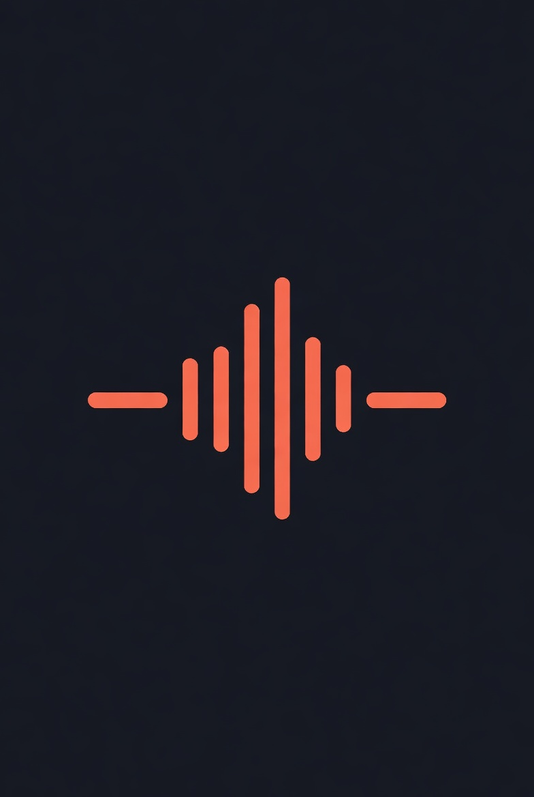

<p align="center">
  
</p>

# DAW Doctor — Ableton Auto-Backup

> **Never lose a session again.**

Continuous, diff-aware cloud backup for Ableton Live projects. Runs silently in the background — the moment you save, DAW Doctor versions it. Instant restore from any point in time.

**Live:** [dawdoctor.creativekonsoles.com](https://dawdoctor.creativekonsoles.com)

---

## What It Does

- **Automatic versioning** — watches your Ableton project folder, captures every save
- **Diff-aware** — only stores what changed, not the full file every time
- **Instant restore** — roll back any project to any previous save with one click
- **Email alerts** — notifies you when a backup completes or fails
- **Dashboard** — see all your projects, version history, and storage usage live
- **No cloud required** — runs fully local, your data stays on your machine

---

## How It Works

```
Ableton saves a .als file
  ↓ Watchdog detects the file change
  ↓ DAW Doctor checksums the file
  ↓ If changed: compress + version → local backup store
  ↓ Dashboard updates in real time
  ↓ Email notification sent (optional)
```

---

## Stack

Python · Flask · SQLite · Watchdog · psutil · Vanilla JS

---

## Setup

```bash
git clone https://github.com/papjamzzz/producer-vault.git
cd producer-vault
cp .env.example .env
# Set ABLETON_PROJECTS_PATH, optional email settings
make setup
make run
```

Opens at `http://127.0.0.1:5565`

Or double-click `launch.command` on Mac.

---

## Environment Variables

| Variable | Required | Description |
|----------|----------|-------------|
| `ABLETON_PROJECTS_PATH` | Yes | Path to your Ableton Projects folder |
| `EMAIL_FROM` | No | Gmail sender address for alerts |
| `EMAIL_PASSWORD` | No | Gmail app password |
| `EMAIL_TO` | No | Where to send backup notifications |

---

## Part of Creative Konsoles

Built by [Creative Konsoles](https://creativekonsoles.com) — tools built using thought.

**[creativekonsoles.com](https://creativekonsoles.com)** &nbsp;·&nbsp; support@creativekonsoles.com

<!-- repo maintenance: 2026-05-12 -->
